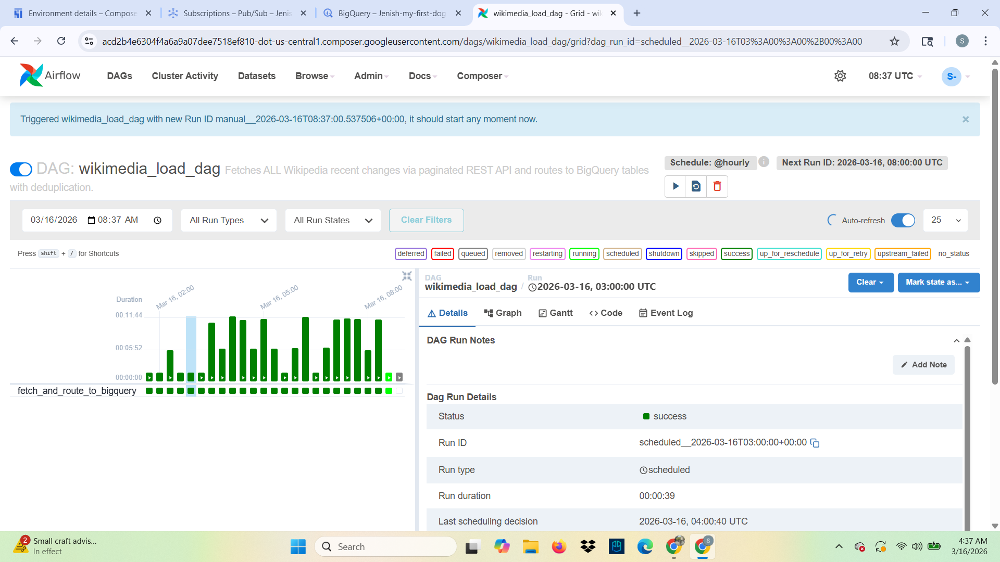
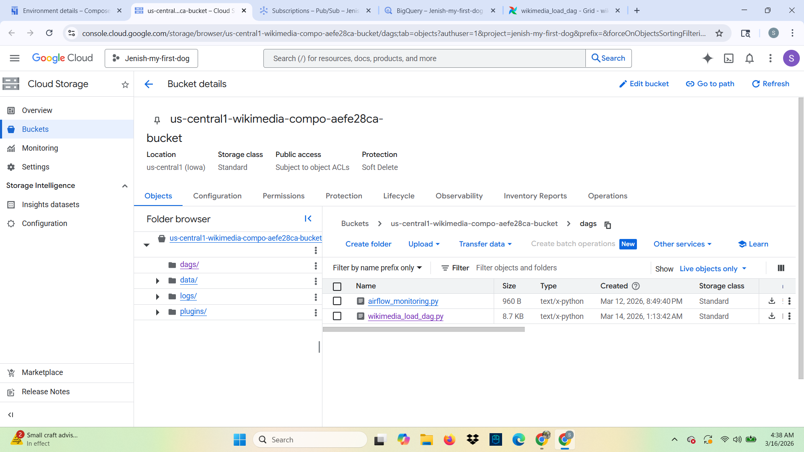
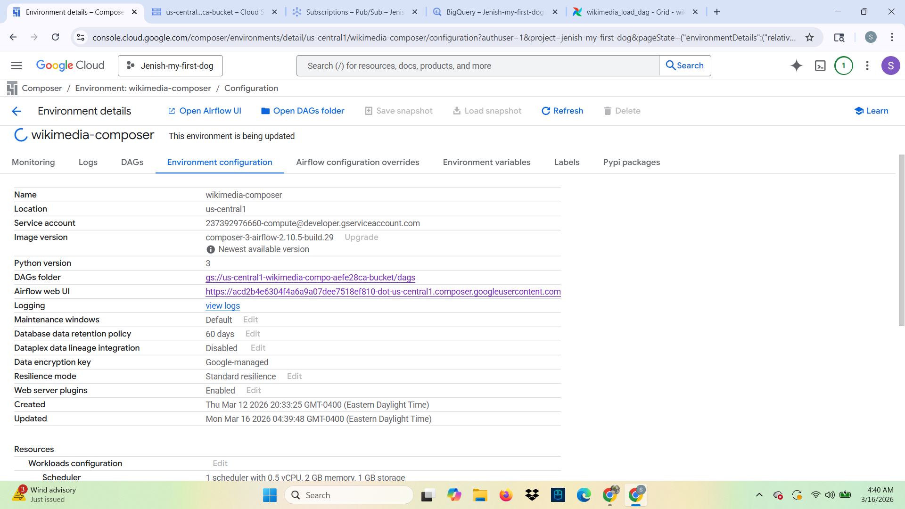
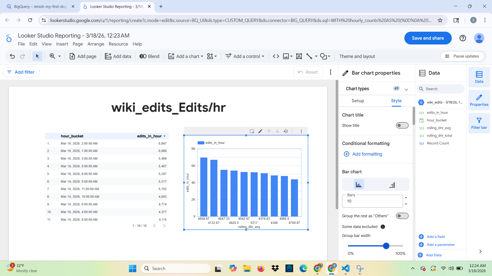
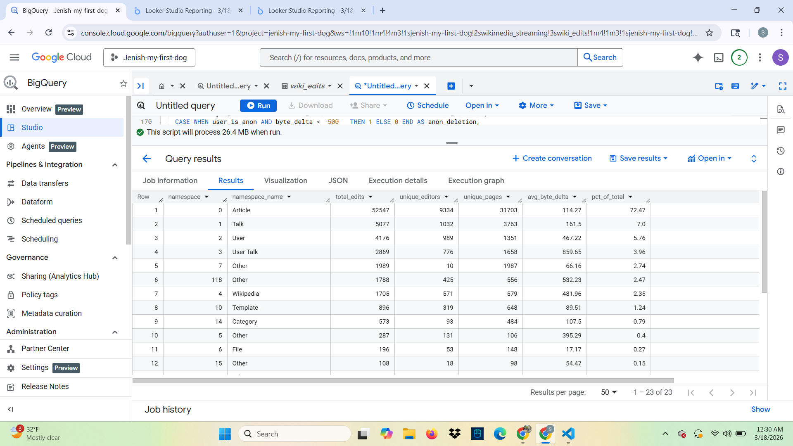
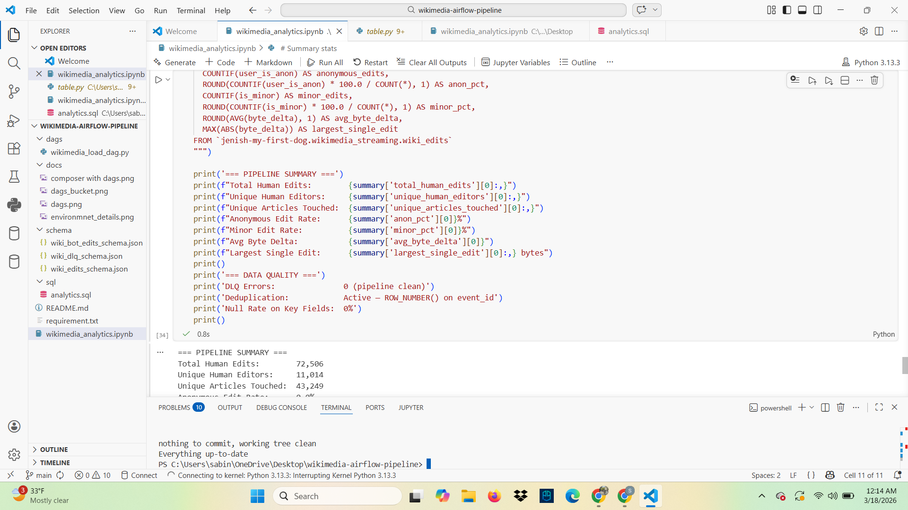

# Wikimedia Airflow Pipeline


A production-grade batch data pipeline built on Google Cloud Composer (managed Airflow) that fetches Wikipedia edit events hourly, stores raw NDJSON snapshots in Google Cloud Storage, and routes human edits, bot edits, and invalid events into separate BigQuery tables with full deduplication.

---

## Pipeline Architecture

```
Wikipedia REST API (en.wikipedia.org)
            │
            ▼
  Cloud Composer (Airflow DAG)
  ┌──────────────────────────────────────┐
  │  Schedule: @hourly                   │
  │  1. Fetch 1-hour window of edits     │
  │     via paginated REST API           │
  │     (up to 10,000 events per run)    │
  │  2. Validate each event              │
  │  3. Enrich with metadata             │
  │  4. Route by type                    │
  │  5. Save raw NDJSON to GCS           │
  │  6. Insert to BigQuery               │
  │  7. Deduplicate on event_id          │
  └──────────────────────────────────────┘
            │
     ┌──────┴──────┐──────────────┐
     ▼             ▼              ▼
wiki_edits    wiki_bot_edits  wiki_dlq
(BigQuery)    (BigQuery)      (BigQuery)
     │
     ▼
  GCS Bucket
  raw/{date}/{run_id}.ndjson
```

---

## Tech Stack

| Tool | Purpose |
|---|---|
| Google Cloud Composer 3 | Managed Airflow environment |
| Apache Airflow 2.10.5 | DAG orchestration |
| Google Cloud Storage | Raw NDJSON file storage |
| Google BigQuery | Data warehouse (3 tables) |
| Python 3 | DAG and transformation logic |
| Wikipedia REST API | Hourly edit data source |
| Looker Studio | Data visualization & dashboards |
| Jupyter Notebook | Analytics & data quality checks |

---

## Real Engineering Challenges Solved

| Challenge | Solution |
|---|---|
| API returns max 500 records per call | Pagination with `rccontinue` — up to 10,000 rows per run |
| Duplicate events across hourly runs | Deduplication using `ROW_NUMBER()` window function on `event_id` |
| Bot traffic pollutes human analytics | Route bot edits to separate `wiki_bot_edits` table |
| Missing/malformed events | Dead Letter Queue — invalid events go to `wiki_dlq` |
| GCP blocks Wikimedia SSE stream | Wikipedia REST API used instead (not blocked) |
| Large BigQuery inserts | Batched inserts in chunks of 500 rows |
| Raw data auditability | Every run saves NDJSON snapshot to GCS |

---

## BigQuery Tables

### `wiki_edits` — Human Edits
- **72,506+ rows** of real Wikipedia human edit events
- Deduplicated on `event_id` — no duplicates
- Fields: `event_id`, `title`, `user`, `byte_delta`, `is_minor`, `comment`, `event_timestamp`, `window_start` and more

### `wiki_bot_edits` — Bot Edits
- **12,264+ rows** of Wikipedia bot edit events
- Same schema as human edits — enables direct comparison
- Bot detection via `bot` flag AND username pattern matching

### `wiki_dlq` — Dead Letter Queue
- Captures invalid or malformed events for monitoring
- Fields: `raw_payload`, `error`, `ingested_at`
- **0 errors recorded** — pipeline is clean ✅

---

## Pipeline Summary

```
=== PIPELINE SUMMARY ===
Total Human Edits:        72,506
Unique Human Editors:     11,014
Unique Articles Touched:  43,249
Anonymous Edit Rate:      0.0%
Minor Edit Rate:          18.7%
Avg Byte Delta:           185.6
Largest Single Edit:      442,997 bytes

=== DATA QUALITY ===
DLQ Errors:               0 (pipeline clean)
Deduplication:            Active — ROW_NUMBER() on event_id
Null Rate on Key Fields:  0%
```

---

## Repository Structure

```
wikimedia-airflow-pipeline/
├── dags/
│   └── wikimedia_load_dag.py         # Main Airflow DAG
├── schema/
│   ├── wiki_edits_schema.json        # BigQuery schema — human edits
│   ├── wiki_bot_edits_schema.json    # BigQuery schema — bot edits
│   └── wiki_dlq_schema.json          # BigQuery schema — DLQ
├── sql/
│   └── analytics.sql                 # 10 advanced analytics queries
├── docs/
│   └── *.png                         # Screenshots & Looker Studio dashboards
├── wikimedia_analytics.ipynb         # Jupyter notebook with full analysis
├── requirements.txt
└── README.md
```

---

## Screenshots

### Airflow DAG — Successful Runs


### Cloud Composer Environment with DAGs


### GCS Bucket — DAGs & Raw NDJSON Files


### Composer Environment Configuration


### Human vs Bot Edits — Looker Studio


### Hourly Edit Rate — Looker Studio


### Editor Segmentation — Looker Studio


### Pipeline Summary — Jupyter Notebook


---

## How to Run

### Prerequisites
- Google Cloud project with Cloud Composer, BigQuery and GCS enabled
- Python 3.8+

### Setup

**1. Create BigQuery dataset and tables:**
```bash
bq mk --dataset your-project:wikimedia_streaming
bq mk --table your-project:wikimedia_streaming.wiki_edits schema/wiki_edits_schema.json
bq mk --table your-project:wikimedia_streaming.wiki_bot_edits schema/wiki_bot_edits_schema.json
bq mk --table your-project:wikimedia_streaming.wiki_dlq schema/wiki_dlq_schema.json
```

**2. Create GCS bucket:**
```bash
gsutil mb -l us-central1 gs://your-wikimedia-raw-data
```

**3. Create Cloud Composer environment:**
```bash
gcloud composer environments create wikimedia-composer \
  --location us-central1 \
  --image-version composer-3-airflow-2.10.5-build.29
```

**4. Upload DAG:**
```bash
gsutil cp dags/wikimedia_load_dag.py gs://your-composer-bucket/dags/
```

**5. Trigger DAG manually:**
Go to Airflow UI → `wikimedia_load_dag` → click ▶️ Trigger DAG

---

## DAG Design

The single DAG `wikimedia_load_dag` runs `@hourly` and executes one task `fetch_and_route_to_bigquery` which:

1. **Fetches** all Wikipedia edits for the current 1-hour window using paginated REST API calls (up to 20 pages × 500 records = 10,000 rows)
2. **Validates** each event — missing title, user, or timestamp goes to DLQ
3. **Enriches** each event with `byte_delta`, `user_is_anon`, `normalized_title`, `window_start`
4. **Routes** events — `bot` flag or username pattern → `wiki_bot_edits`, valid humans → `wiki_edits`, invalid → `wiki_dlq`
5. **Saves** raw NDJSON snapshot to GCS at `raw/{date}/{run_id}.ndjson`
6. **Inserts** to BigQuery in batches of 500
7. **Deduplicates** both `wiki_edits` and `wiki_bot_edits` using `ROW_NUMBER() OVER (PARTITION BY event_id ORDER BY ingested_at DESC)`

---

## Analytics

The `sql/analytics.sql` file contains 10 senior-level queries and `wikimedia_analytics.ipynb` contains full analysis with results:

| # | Query | Technique |
|---|---|---|
| 1 | Pipeline health dashboard | Multi-table UNION ALL |
| 2 | Hourly ingestion rate | Time bucketing, throughput analysis |
| 3 | Editor behavior segmentation | `NTILE()`, `ROW_NUMBER()` window functions |
| 4 | Article edit velocity + edit war detection | Composite scoring algorithm |
| 5 | Vandalism detection | Multi-signal risk scoring |
| 6 | Bot vs human comparison | Side-by-side behavioral metrics |
| 7 | Namespace breakdown | `OVER()` percentage calculation |
| 8 | Deduplication audit | Pipeline health verification |
| 9 | Rolling 6-hour sliding window | `ROWS BETWEEN` window frames |
| 10 | DLQ error pattern analysis | Error monitoring |

---

## Key Design Decisions

**Why paginated REST API instead of single call?**
The Wikipedia API returns max 500 records per call. Using `rccontinue` pagination allows fetching the complete 1-hour window of edits (typically 3,000–10,000 records) rather than just the latest 500.

**Why separate tables for bots vs humans?**
Bot edits make up ~15% of Wikipedia traffic but have completely different characteristics — higher frequency, larger byte deltas, no comments. Mixing them distorts analytics on human editor behavior.

**Why save raw NDJSON to GCS?**
Raw file storage enables full reprocessing if the BigQuery schema changes, provides an audit trail, and follows the medallion architecture pattern (raw → structured → analytics).

**Why deduplicate after every run?**
The REST API occasionally returns overlapping records across hourly windows. Deduplication on `event_id` using `ROW_NUMBER()` ensures exactly-once semantics in the final tables without requiring complex state management in the DAG.

**Why Cloud Composer over self-hosted Airflow?**
Cloud Composer provides managed infrastructure, automatic scaling, native GCP authentication, and built-in monitoring — eliminating operational overhead and following GCP best practices for production workloads.

